# 📚 LearnHub — Full-Stack EdTech Learning Management System
## Complete System Architecture, REST API Reference, Database Schema & User Manual

> **Document Version:** 1.0.0 Enterprise Edition  
> **Target Audience:** Developers, Technical Evaluators, Instructors, Platform Administrators  
> **Technology Ecosystem:** MERN Stack (React 18 + Vite, Node.js 24, Express 4, MongoDB / Mongoose, Bootstrap 5 + Custom Design System)  
> **PDF Export:** [LearnHub_System_Documentation.pdf](file:///d:/LearnHub/docs/LearnHub_System_Documentation.pdf)  
> **HTML Version:** [LearnHub_System_Documentation.html](file:///d:/LearnHub/docs/LearnHub_System_Documentation.html)

---

## 📋 Table of Contents
1. [Executive Overview & Platform Summary](#1-executive-overview--platform-summary)
2. [System Architecture & Ecosystem Stack](#2-system-architecture--ecosystem-stack)
3. [Database Schema & Data Models](#3-database-schema--data-models)
4. [RESTful API Reference Specification](#4-restful-api-reference-specification)
5. [Security & Role-Based Access Control (RBAC)](#5-security--role-based-access-control-rbac)
6. [Visual UI & Workflow Walkthrough (Screenshots)](#6-visual-ui--workflow-walkthrough)
7. [User Manuals (Student, Instructor, Administrator)](#7-user-manuals)
8. [Installation, Setup & Deployment Operations](#8-installation-setup--deployment-operations)

---

## 1. Executive Overview & Platform Summary

**LearnHub** is an enterprise-ready, cloud-native Learning Management System (LMS) and e-learning platform designed to deliver a seamless, high-performance education experience.

### Core Capabilities
- **🎓 For Students:** Course discovery, multi-criteria filtering, interactive video player classroom with automatic lesson checkmarking, direct course enrollment, and personalized dashboards.
- **👨‍🏫 For Instructors:** Course authoring suite, module/lesson builder, video attachment, enrollment analytics, and student progress tracking.
- **🛡️ For Administrators:** Centralized control center, real-time KPI metrics, user management and role elevation, course publishing moderation, enrollment audits, and financial reporting.
- **⚡ Zero-Latency Fallback Architecture:** Automated dual-tier storage engine (MongoDB ODM with fallback Adaptive In-Memory Data Store + JSON disk synchronization).

---

## 2. System Architecture & Ecosystem Stack

```
+-----------------------------------------------------------------------+
|                Client Layer (React 18.2 + Vite 5.1)                  |
|  - Bootstrap 5 + Custom CSS Glassmorphism + Lucide Icons             |
|  - React Router DOM v7 (Declarative Protected Route Guards)           |
|  - Context API: AuthContext, CourseContext, ToastContext, ThemeContext|
+-----------------------------------▲-----------------------------------+
                                    │ (HTTP REST / JWT Bearer)
+-----------------------------------▼-----------------------------------+
|               API Gateway & Middleware Layer (Express 4.22)           |
|  - CORS Security Policy                                              |
|  - Request Body Parsing & Sanitization                                |
|  - JWT Bearer Authentication & Claims Extraction                     |
|  - Role-Based Access Control (requireRole: student/instructor/admin) |
+-----------------------------------▲-----------------------------------+
                                    │
+-----------------------------------▼-----------------------------------+
|               Controllers & Business Logic Engine                     |
|  - authController    - courseController   - orderController           |
|  - adminController   - progressController                             |
+-----------------------------------▲-----------------------------------+
                                    │
+-----------------------------------▼-----------------------------------+
|                 Persistence & Storage Layer                           |
|  - Mongoose ODM (MongoDB Engine)                                      |
|  - Adaptive In-Memory Store with JSON Disk Sync (Fallback Mode)       |
+-----------------------------------------------------------------------+
```

### Technology Matrix

| Layer | Technology | Version | Purpose |
| :--- | :--- | :--- | :--- |
| **Frontend Framework** | React.js | 18.2.0 | Reactive UI components and state management |
| **Build System** | Vite | 5.1.6 | High-speed HMR development and optimized production bundling |
| **Styling & UI** | Bootstrap 5 + Custom CSS | 5.3.3 | Design tokens, responsive grid, gradients, and custom components |
| **Icons** | Lucide React | 0.344.0 | Modern SVG iconography |
| **Routing** | React Router DOM | 7.18.2 | Single-page application routing and role-guarded routes |
| **Backend Framework** | Express.js / Node.js | Express 4.22 / Node 24 | RESTful API server and request routing |
| **Authentication** | JSON Web Tokens (JWT) | 9.0.3 | Stateless token-based user authentication |
| **Password Security** | BCrypt.js | 3.0.3 | 10-round cryptographic salting and hashing |
| **Database** | MongoDB / Mongoose | 8.24.3 | Object Document Mapping with schema validation |

---

## 3. Database Schema & Data Models

### 3.1 User Model (`server/models/User.js`)
```javascript
{
  name: { type: String, required: true, trim: true },
  email: { type: String, required: true, unique: true, lowercase: true },
  phone: { type: String, default: '' },
  password: { type: String, required: true }, // BCrypt hash
  role: { type: String, enum: ['student', 'instructor', 'admin'], default: 'student' },
  avatar: { type: String, default: 'avatar_url' },
  bio: { type: String, default: '' },
  enrolledCourses: [{ type: String }],
  wishlist: [{ type: String }],
  timestamps: true
}
```

### 3.2 Course Model (`server/models/Course.js`)
```javascript
{
  id: { type: String, required: true, unique: true, index: true },
  title: { type: String, required: true, trim: true },
  subtitle: { type: String, default: '' },
  description: { type: String, default: '' },
  category: { type: String, required: true, index: true },
  level: { type: String, enum: ['Beginner', 'Intermediate', 'Advanced'], default: 'Beginner' },
  price: { type: Number, required: true, default: 0 },
  originalPrice: { type: Number, default: 0 },
  rating: { type: Number, default: 4.8 },
  reviewsCount: { type: Number, default: 0 },
  hours: { type: Number, default: 10 },
  lessonsCount: { type: Number, default: 10 },
  languages: [{ type: String }],
  techStack: [{ type: String }],
  instructorName: { type: String },
  instructorRole: { type: String },
  instructorBio: { type: String },
  thumbnail: { type: String },
  modules: [
    {
      id: { type: String, required: true },
      title: { type: String, required: true },
      lessons: [
        {
          id: { type: String, required: true },
          title: { type: String, required: true },
          duration: { type: String, default: '15:00' },
          videoUrl: { type: String },
          isLocked: { type: Boolean, default: false },
          type: { type: String, enum: ['video', 'reading'], default: 'video' }
        }
      ]
    }
  ],
  status: { type: String, enum: ['published', 'draft', 'pending'], default: 'published' },
  featured: { type: Boolean, default: false }
}
```

### 3.3 Progress Model (`server/models/Progress.js`)
```javascript
{
  key: { type: String, required: true, unique: true, index: true }, // userId_courseId
  userId: { type: String, required: true, index: true },
  courseId: { type: String, required: true, index: true },
  completedLessons: [{ type: String }],
  percentage: { type: Number, default: 0 },
  lastWatchedLesson: { type: String, default: '' },
  certificateEarned: { type: Boolean, default: false },
  timestamps: true
}
```

---

## 4. RESTful API Reference Specification

### Authentication Routes (`/api/auth`)
| Method | Route | Access | Purpose & Body Parameters |
| :--- | :--- | :--- | :--- |
| `POST` | `/api/auth/register` | Public | Register student: `{ name, email, password, phone }` |
| `POST` | `/api/auth/login` | Public | Login user: `{ email, password }` |
| `POST` | `/api/auth/logout` | Public | Terminate session / client token invalidation |
| `GET` | `/api/auth/me` | User | Get current authenticated profile & enrollments |
| `PUT` | `/api/auth/profile` | User | Update personal information: `{ name, phone, bio, avatar }` |

### Course Catalog Routes (`/api/courses`)
| Method | Route | Access | Purpose & Body Parameters |
| :--- | :--- | :--- | :--- |
| `GET` | `/api/courses` | Public | Retrieve course list (supports `category, level, search`) |
| `GET` | `/api/courses/:id` | Public | Retrieve detailed course curriculum & syllabus |
| `POST` | `/api/courses/:id/enroll` | User | Enroll logged-in student in course |
| `POST` | `/api/courses` | Admin | Create new course definition |
| `DELETE` | `/api/courses/:id` | Admin | Delete course & cascade enrollment updates |

### Learning Progress Routes (`/api/progress`)
| Method | Route | Access | Purpose & Body Parameters |
| :--- | :--- | :--- | :--- |
| `GET` | `/api/progress/:courseId` | User | Fetch completed lesson IDs & completion percentage |
| `POST` | `/api/progress/lesson-complete` | User | Mark lesson done: `{ courseId, lessonId }` |

### Admin Control Routes (`/api/admin`)
| Method | Route | Access | Purpose & Body Parameters |
| :--- | :--- | :--- | :--- |
| `GET` | `/api/admin/stats` | Admin | Get platform aggregate KPI metrics |
| `GET` | `/api/admin/users` | Admin | Fetch list of all registered platform users |
| `POST` | `/api/admin/users` | Admin | Create new user account |
| `PUT` | `/api/admin/users/:userId` | Admin | Edit user profile details |
| `PUT` | `/api/admin/users/:userId/role` | Admin | Update user role (`student / instructor / admin`) |
| `DELETE`| `/api/admin/users/:userId` | Admin | Delete user record |
| `GET` | `/api/admin/enrollments` | Admin | Inspect platform enrollment connections |

---

## 5. Security & Role-Based Access Control (RBAC)

### Access Control Matrix
| Feature / Area | Guest | Student | Instructor | Administrator |
| :--- | :---: | :---: | :---: | :---: |
| Browse Course Catalog & Details | ✅ | ✅ | ✅ | ✅ |
| Course Direct Enrollment | ❌ | ✅ | ✅ | ✅ |
| Access Video Classroom & Mark Lessons | ❌ | ✅ (Enrolled) | ✅ | ✅ |
| Student Dashboard & Profile | ❌ | ✅ | ✅ | ✅ |
| Author Courses / Curriculum Builder | ❌ | ❌ | ✅ | ✅ |
| Admin Dashboard, User & Revenue Reports | ❌ | ❌ | ❌ | ✅ |

---

## 6. Visual UI & Workflow Walkthrough

### 6.1 Landing & Discovery Portal (`/`)
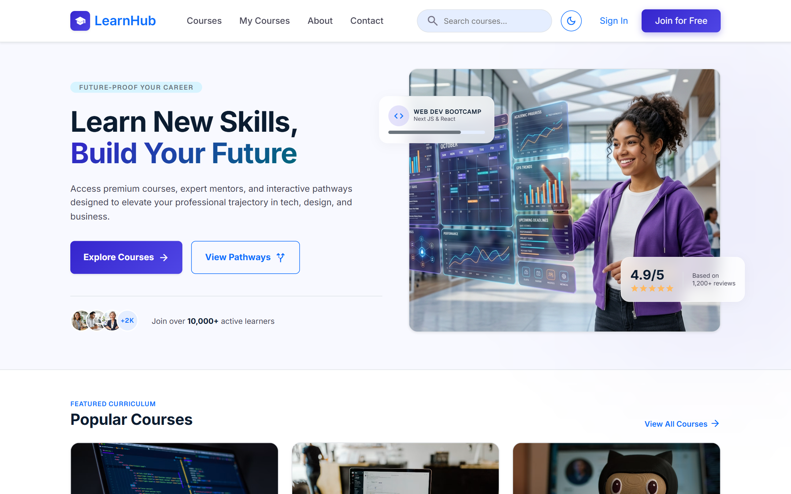
*Modern Hero Showcase, Featured Course Highlights, Category Exploration, and Community Stats.*

### 6.2 Course Search & Filter Catalog (`/courses`)
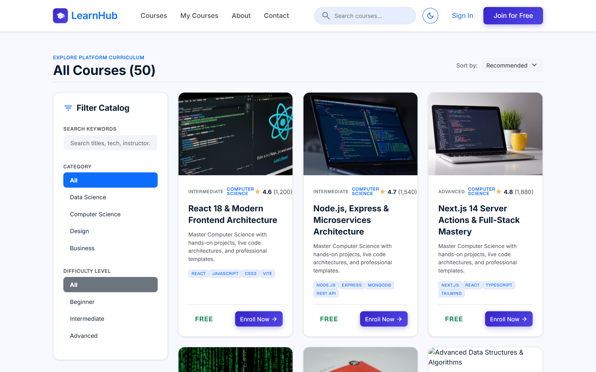
*Dynamic Course Catalog with category sidebar filters, difficulty badges, search bar, and live pricing.*

### 6.3 Course Details & Curriculum Preview (`/course/:id`)
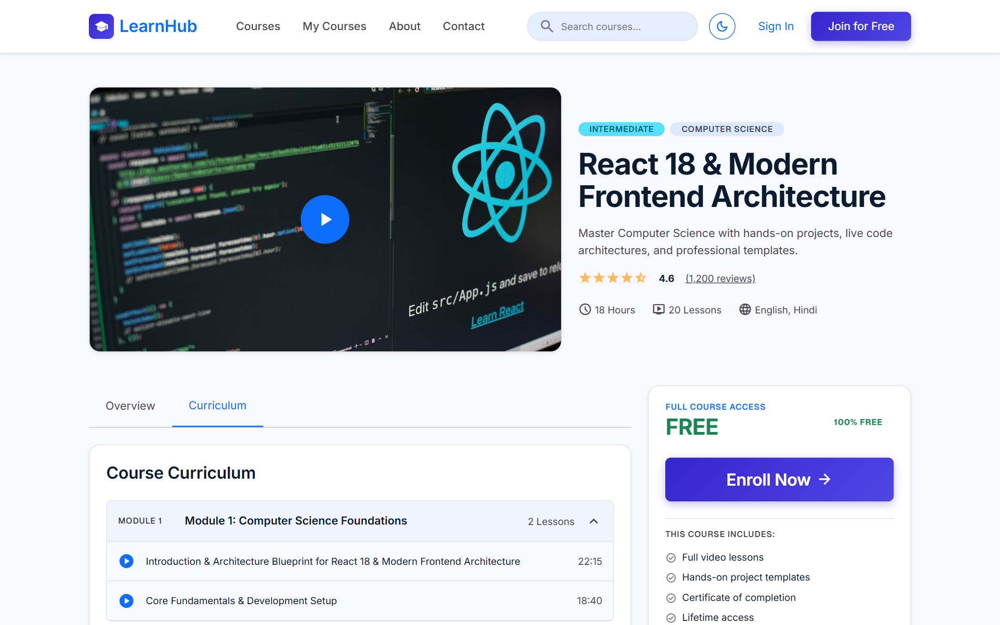
*Course Details with full syllabus module accordions, instructor biography, ratings, and instant enrollment.*

### 6.4 Authentication Suite (`/login` & `/register`)
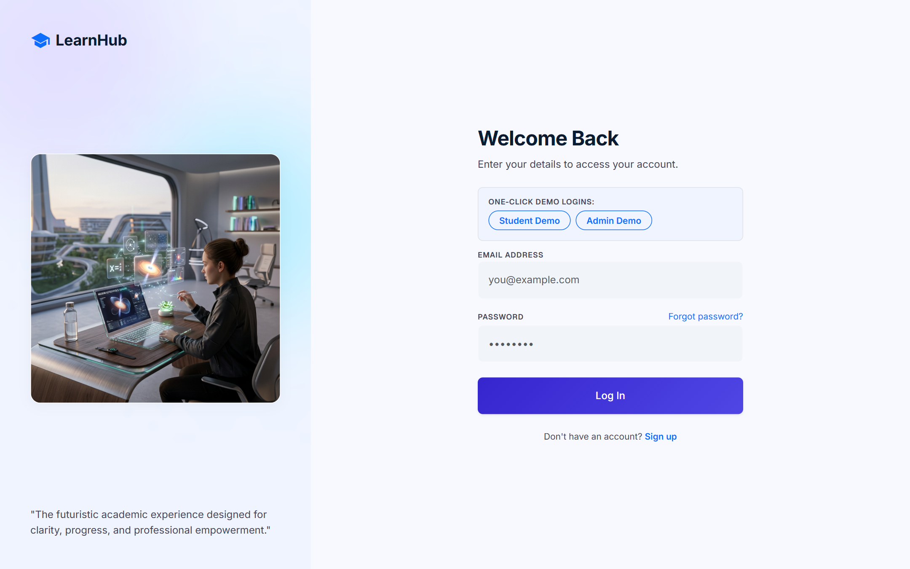
*Clean Authentication interface with validation and demo quick-fill presets.*

### 6.5 Interactive Video Learning Classroom (`/course/:id/learn`)
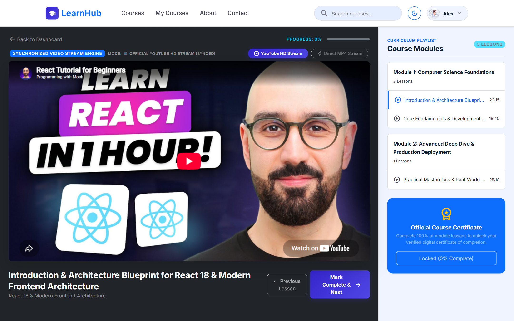
*Interactive Video Learning Player with automated lesson progression, lesson playlist navigation, and dynamic checkmarking.*

### 6.6 Student Dashboard & My Learning (`/dashboard` & `/my-courses`)
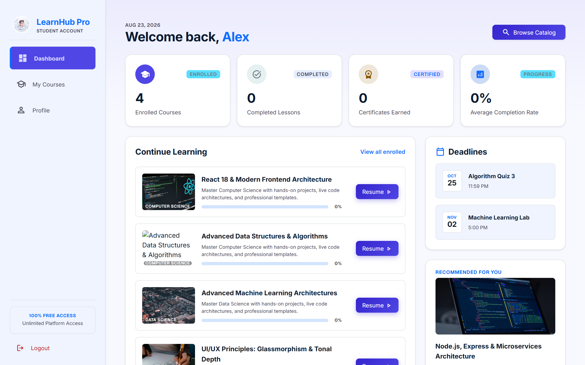
*Student Dashboard showing active enrolled courses, overall completion percentages, study hours, and quick continue buttons.*

### 6.7 Admin Command Center & Metrics (`/admin`)
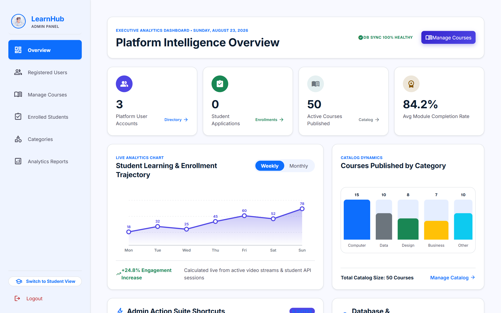
*Administrator Command Center with revenue metrics, student counts, course completion stats, and navigation tabs.*

### 6.8 Admin Courses Management (`/admin/courses`)
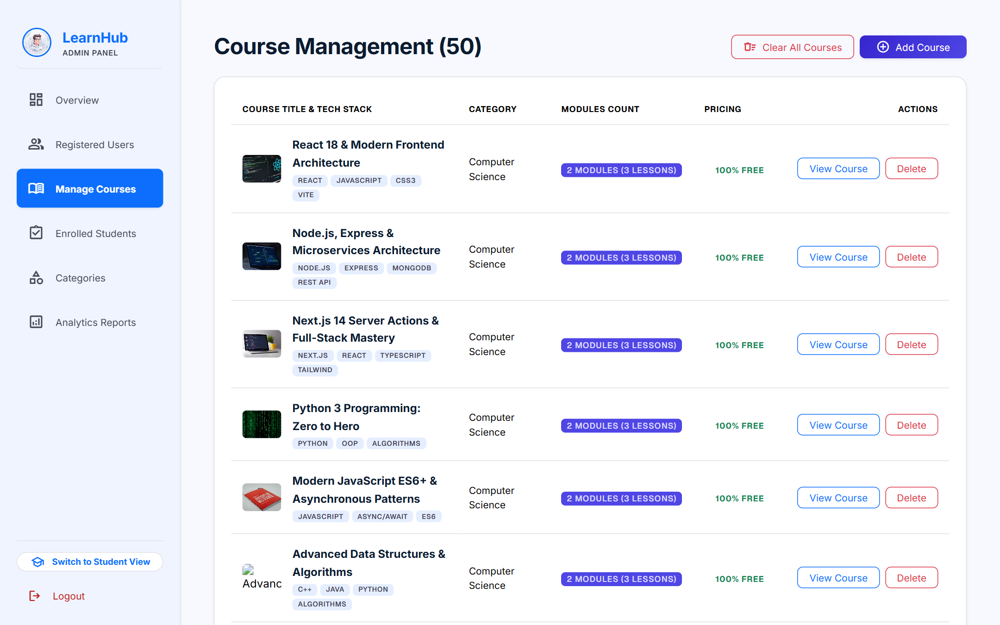
*Course moderation, curriculum editing, publishing toggle, and deletions.*

### 6.9 Admin Users Management (`/admin/users`)
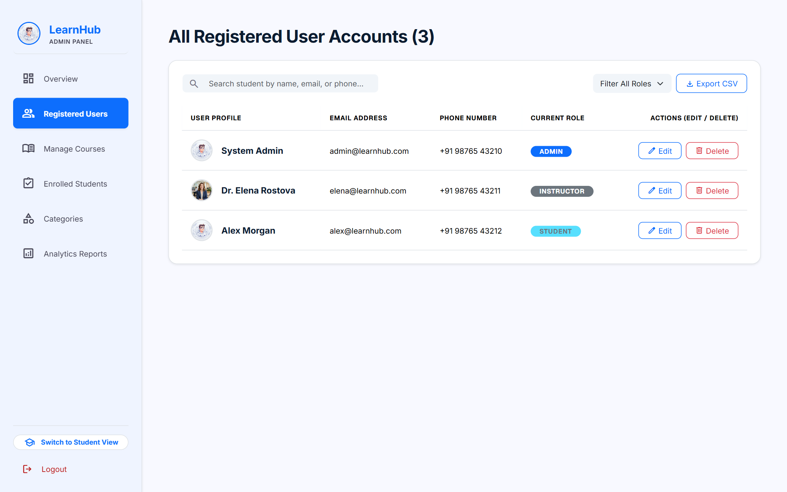
*User accounts, role elevation, and access management.*

### 6.10 Admin Enrollments Management (`/admin/enrollments`)
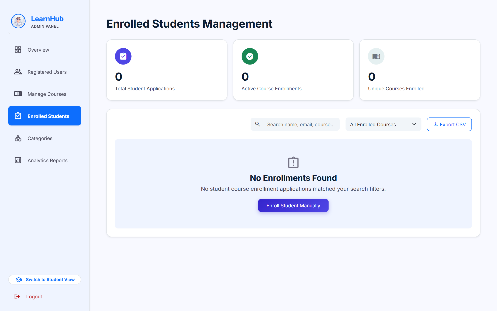
*Platform-wide active student course enrollments and records.*

### 6.11 Admin Financial & Operational Reports (`/admin/reports`)
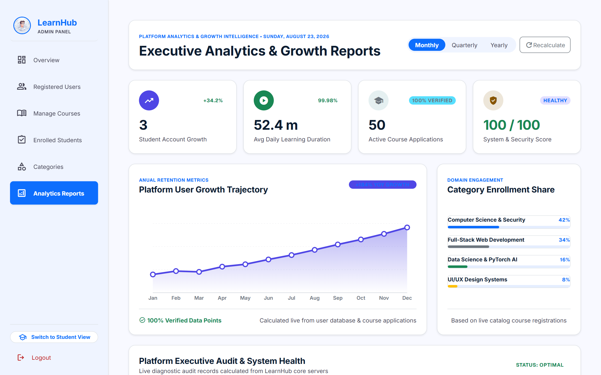
*Revenue analytics, enrollment trajectory charts, and transaction export tools.*

---

## 7. User Manuals

### 7.1 Student Manual
1. **Login / Sign Up:** Use `/register` or `/login` with credentials `alex@learnhub.com` / `student123`.
2. **Finding Courses:** Use the Catalog filter or search bar to discover courses.
3. **Enrolling:** Click *Enroll Now* on any course details page.
4. **Learning:** Open enrolled courses in the Video Player, watch lectures, and tick off completed modules.

### 7.2 Instructor Manual
1. **Login:** Use credentials `elena@learnhub.com` / `instructor123`.
2. **Course Creation:** Navigate to courses to draft courses, organize modules, and upload videos.
3. **Tracking:** Monitor student completion rates and feedback.

### 7.3 Administrator Manual
1. **Login:** Use credentials `admin@learnhub.com` / `admin123`.
2. **User Control:** Elevate users to instructor or admin, manage accounts under `/admin/users`.
3. **Course Moderation:** Approve, edit, or remove courses under `/admin/courses`.
4. **Enrollments & Financial Oversight:** View revenue breakdowns and active enrollments under `/admin/enrollments` and `/admin/reports`.

---

## 8. Installation, Setup & Deployment Operations

### Prerequisites
- Node.js v18+ (Node 20+ / Node 24+ recommended)
- NPM v9+

### Quick Start
```bash
# 1. Start Backend Server (Port 5000)
cd server
npm install
node index.js

# 2. Start Frontend Client (Port 3000)
cd ../client
npm install
npm run dev
```

---
*Documentation compiled and generated automatically for LearnHub Enterprise EdTech Platform.*
